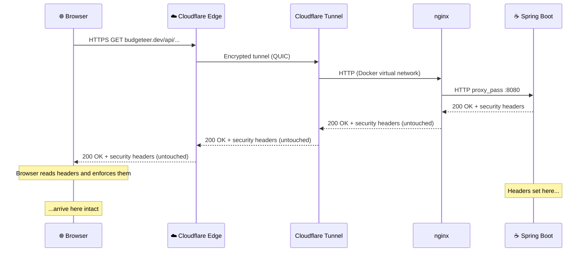
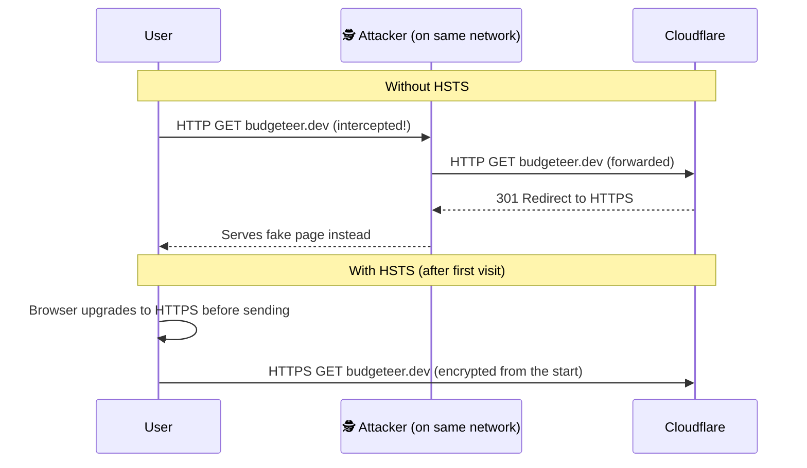
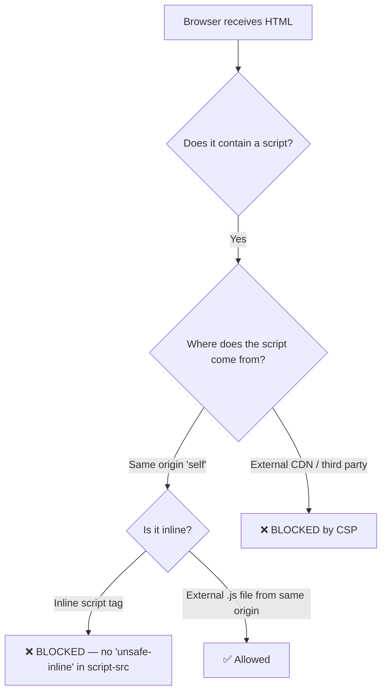
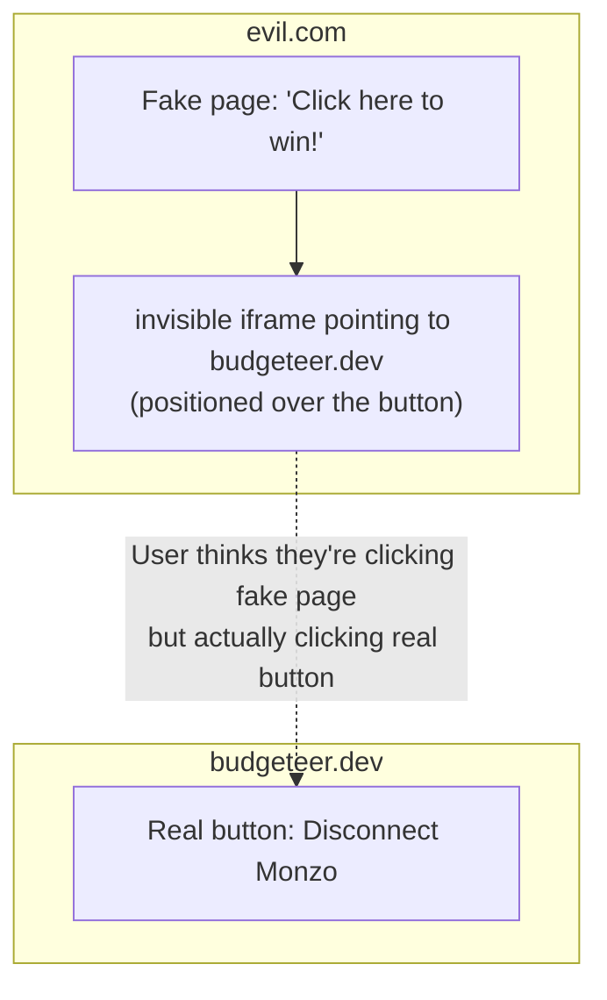
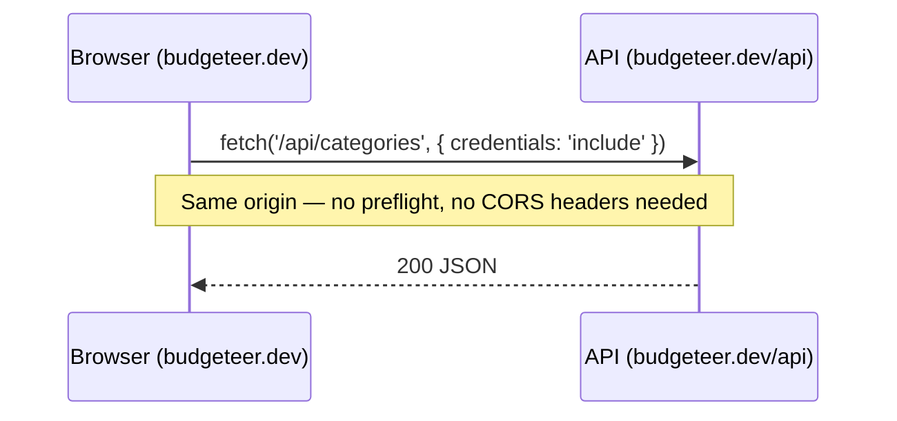
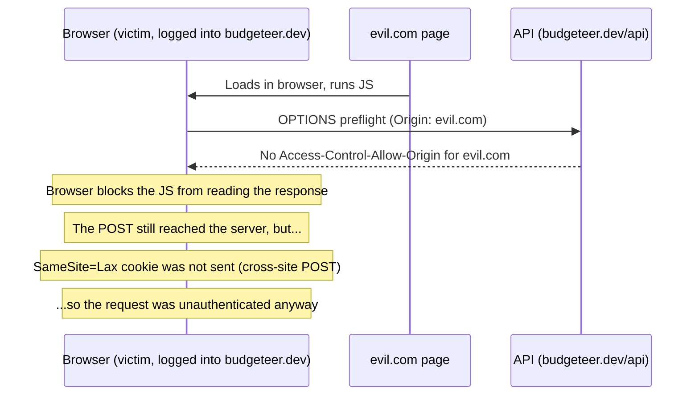
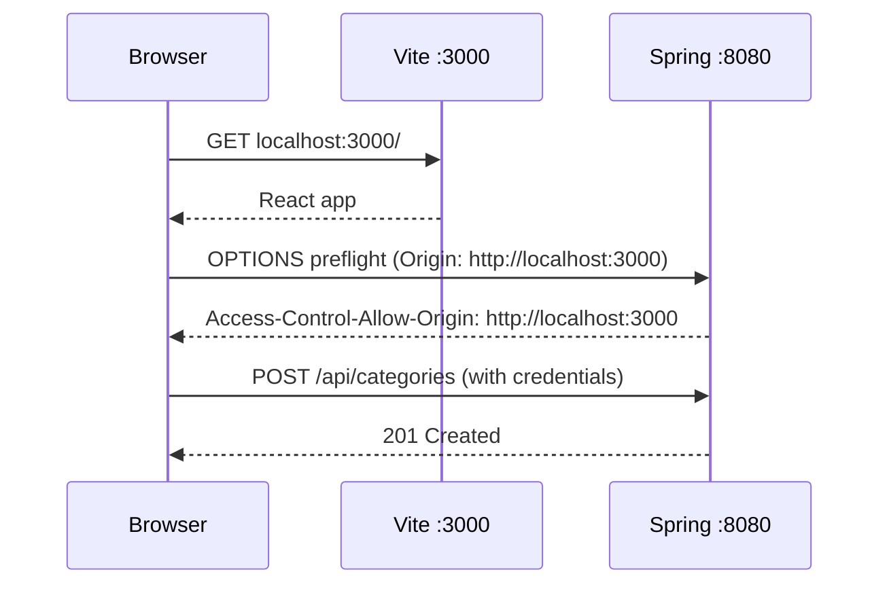

# Security Headers — What They Do and Why Budgeteer Needs Them

Browsers are powerful but trusting by default. A browser will run any script a page delivers, load resources from anywhere, and send cookies on any request — unless you tell it otherwise. Security headers are your instructions to the browser about what it is and is not allowed to do. Each header targets a specific category of attack.

---

## The Network Path — Headers Survive Cloudflare

Before anything else: you might wonder whether headers set deep inside the Docker network actually reach the browser, given that TLS terminates at Cloudflare. They do — headers travel in the HTTP response body, not in the TLS handshake. Cloudflare forwards the response (including all headers) back to the browser untouched.



**The only plain-text hop** is inside the NUC on the Docker virtual network — equivalent to localhost. The browser's TLS session with Cloudflare ends at the edge, but the response content (including headers) passes through the tunnel encrypted and is delivered faithfully.

---

## 1. Strict-Transport-Security (HSTS)

### The attack it prevents

Without HSTS, a user who types `budgeteer.dev` (without `https://`) into their browser triggers a plain HTTP request. Cloudflare then redirects to HTTPS — but that first HTTP request is already on the network. An attacker positioned between the user and the internet (coffee shop Wi-Fi, compromised router) can intercept it.



After a browser sees `Strict-Transport-Security` once, it remembers for `max-age` seconds (one year here) and **never attempts plain HTTP** for that domain — the upgrade happens locally, before any network request.

### Why `AnyRequestMatcher.INSTANCE` is needed

Spring Security's default HSTS behaviour only sends the header when `request.isSecure()` is true. Because TLS terminates at Cloudflare, Spring Boot receives plain HTTP on the internal Docker network — so `request.isSecure()` is always false, and the header would never be sent without this override.

`AnyRequestMatcher.INSTANCE` tells Spring to send the header on every response regardless. This is safe: browsers only act on HSTS when the response arrived over HTTPS — and it always did, from the browser's perspective.

> **Why `preload` is omitted:** Preload submits the domain to a permanent browser list that cannot be removed quickly. For a personal home server it's unnecessary risk — skip it unless you're certain the domain is permanent.

---

## 2. Content-Security-Policy (CSP)

### The attack it prevents — XSS

Cross-Site Scripting (XSS) is when an attacker injects a `<script>` tag into a page your browser renders. If the script runs, it can steal your session cookie, read your data, or make API calls on your behalf.



CSP is a whitelist. The browser reads it before executing or loading anything. If a script, style, or connection isn't explicitly permitted, the browser blocks it and logs a violation.

### The policy directive by directive

```
default-src 'none'        — deny everything not explicitly listed below
script-src 'self'         — JS only from budgeteer.dev; no CDN, no inline scripts
style-src 'self'
        'unsafe-inline'   — CSS from budgeteer.dev; 'unsafe-inline' for Tailwind (remove later)
connect-src 'self'        — fetch() and XHR only to budgeteer.dev/api/*; no external APIs
img-src 'self' data:      — images from same origin + base64-encoded inline images
font-src 'self'           — no Google Fonts or CDN fonts
base-uri 'self'           — prevents <base href> injection (redirects all relative URLs)
form-action 'self'        — HTML form posts only to same origin
frame-ancestors 'none'    — modern equivalent of X-Frame-Options: DENY
```

> **`connect-src` and the Monzo OAuth flow:** Monzo OAuth works via `window.location` redirects (top-level navigations), not `fetch()`. `connect-src` does not govern top-level navigations — the OAuth flow is unaffected.

> **Removing `'unsafe-inline'`:** When the React frontend is built and Tailwind is configured as a build-time step (generating a static CSS file), remove `'unsafe-inline'` from `style-src`. This closes the last inline-injection gap.

---

## 3. X-Frame-Options and `frame-ancestors` — Clickjacking

### The attack it prevents

Clickjacking loads your app invisibly inside an `<iframe>` overlaid on a fake page. The user thinks they're clicking a button on the attacker's page — they're actually clicking a button in your app.



**`X-Frame-Options: DENY`** — older browsers.
**`frame-ancestors 'none'`** in CSP — modern browsers (CSP takes precedence where supported).

Both are set for belt-and-suspenders compatibility across all browser versions.

---

## 4. X-Content-Type-Options: nosniff

Without this header, browsers may guess a file's type from its content rather than trusting the `Content-Type` header. A file served as `text/plain` might be executed as JavaScript if it looks like a script.

This matters most if Budgeteer ever serves user-uploaded content (receipts, attachments). A crafted file named `receipt.txt` but containing JavaScript could execute as a script if the browser sniffs the type. `nosniff` tells the browser to trust the server's declared type and never guess.

---

## 5. CORS — Who Is Allowed to Talk to the API?

CORS is the most misunderstood security mechanism. It is **not** a way to block requests — servers always receive them. It is a browser mechanism that controls whether JavaScript on one origin is allowed to **read the response** from another origin.

### Case 1: Same origin in production — no CORS at all

In production, the browser, the static files, and the API are all on `budgeteer.dev`. From the browser's perspective everything is same-origin, so no CORS preflight ever fires.



### Case 2: Malicious site tries to call the API

An attacker's page at `evil.com` tries to make a credentialed API call using the victim's session cookie.



Two independent defences stop this: CORS blocks the response read, and `SameSite=Lax` ensures the session cookie was never sent.

### Case 3: Dev — Vite at :3000 calling Spring at :8080

During development, the frontend runs on `localhost:3000` and the backend on `localhost:8080`. These are different ports, so the browser treats them as different origins and fires preflight requests.



The `app.cors.allowed-origins=http://localhost:3000` property in `application.properties` enables this.

> **Better dev approach:** Configure Vite to proxy `/api` → `http://localhost:8080`. The browser sees all traffic on `:3000` (same origin), no CORS or `SameSite` issues, and the setup mirrors production more closely. Do this when building the frontend.

### Why wildcard (`*`) cannot be used

`allowCredentials(true)` is required so the session cookie is included in cross-origin requests. Spring Security rejects `allowedOrigins("*")` combined with `allowCredentials(true)` — a browser security requirement. The explicit per-profile origin list enforces this correctly.

---

## 6. Error Detail Suppression

A Spring Boot stack trace exposes:

- Library names and versions (→ known CVEs)
- Internal package names and class paths
- Database schema details (table names, column names from constraint errors)
- Application logic hints

The `GlobalExceptionHandler` already catches application exceptions and returns structured `ApiError` responses. But Spring has a fallback `/error` endpoint for anything that slips through. Without these properties it returns full stack traces:

```properties
# application-prod.properties
server.error.include-message=never
server.error.include-stacktrace=never
server.error.include-binding-errors=never
```

> **Common pitfall — wrong prefix:** The incorrect prefix `spring.web.error.*` is silently ignored by Spring Boot. The correct prefix is `server.error.*`. The two look similar enough to cause subtle bugs: error suppression appears configured but is not actually active.

---

## 7. Deferred Headers

These are low-priority for the current phase (no analytics, no external links, no hardware access) and are tracked for the frontend phase.

**`Referrer-Policy`:** Controls how much of the current URL is sent as a `Referer` header when navigating away. Relevant once the app links to external pages. Set to `strict-origin-when-cross-origin`.

**`Permissions-Policy`:** Disables browser features (camera, microphone, geolocation, payment) that the app does not use. Set to `camera=(), microphone=(), geolocation=()`.

---

## Quick Reference

| Header | Value | Prevents | Where set |
|--------|-------|----------|-----------|
| `Strict-Transport-Security` | `max-age=31536000; includeSubDomains` | Plain-HTTP interception, downgrade attacks | Spring Security HSTS DSL |
| `Content-Security-Policy` | See `SecurityConfig.CSP_POLICY` | XSS, resource injection, clickjacking (modern) | Spring Security CSP DSL |
| `X-Frame-Options` | `DENY` | Clickjacking (legacy browsers) | Spring Security frameOptions DSL |
| `X-Content-Type-Options` | `nosniff` | MIME-type sniffing / content injection | Spring Security contentTypeOptions DSL |
| CORS `Access-Control-Allow-Origin` | Profile-specific origin (never `*`) | Cross-site API abuse via credentialed requests | `CorsConfigurationSource` bean |
| Error suppression | `server.error.*=never` | Stack trace / version / schema leaks | `application-prod.properties` |

---

*Created: 2026-05-09 | Update when adding Referrer-Policy and Permissions-Policy in the frontend phase.*
