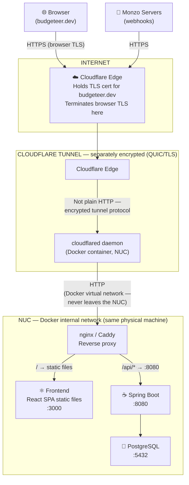
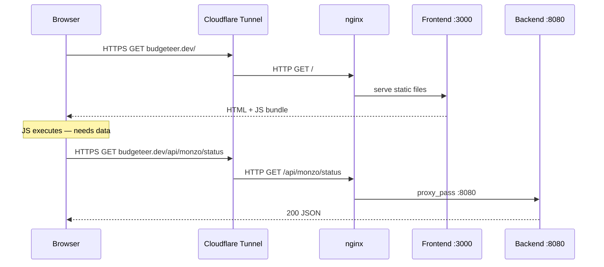
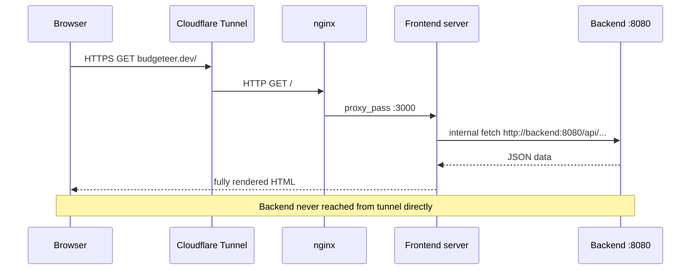
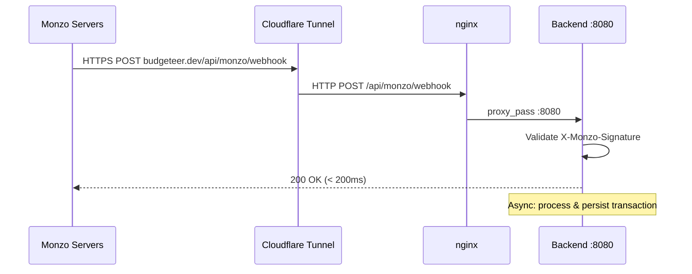

# Networking Architecture & Security Headers Rationale

> Planning note for the Security Headers & Hardening task.
> When the task is complete, promote a polished version to `docs/architecture/NETWORKING.md`.

---

## Production Topology



### What's encrypted where

| Leg | Protocol | Notes |
|-----|----------|-------|
| Browser → Cloudflare Edge | HTTPS (TLS 1.3) | Cloudflare holds the cert for `budgeteer.dev` |
| Cloudflare Edge → `cloudflared` | QUIC/TLS (tunnel protocol) | Separately encrypted — not plain HTTP over the internet |
| `cloudflared` → nginx → containers | HTTP | Docker virtual network on a single machine — equivalent to localhost, never leaves the NUC |

**"TLS terminates at the edge"** means the browser's TLS session ends at Cloudflare because they hold the certificate. The onward leg through the tunnel is a *separately* encrypted channel. The only truly plain-text hop is inside the machine on a virtual Docker network — acceptable for a single-machine setup.

Optional hardening: configure nginx with a [Cloudflare Origin CA](https://developers.cloudflare.com/ssl/origin-configuration/origin-ca/) certificate to get TLS on the internal hop too. Low priority for a personal home server.

---

## Why nginx Routes `/api/*` to the Backend

This is determined by whether the frontend does **server-side rendering (SSR)** or is a **client-side SPA**.

### React / Vite SPA — current plan

The frontend container is a static file server. It serves HTML and the JS bundle, then its job is done. Once the JS runs in the browser, **the browser itself makes API calls** — those originate from the user's machine and travel back through the tunnel.



So nginx must route `/api/*` to the backend because those requests come from the browser, not from the frontend container.

### SSR frontend (Next.js / Remix) — not current plan, but worth knowing

With SSR the frontend server fetches data on the user's behalf, server-side. API calls stay inside the Docker network and never traverse the tunnel.



With SSR, the backend could be completely unreachable from the internet except for the webhook endpoint. Worth keeping in mind when choosing the frontend framework.

---

## What Actually Needs to Be Internet-Facing

| Path | Needs tunnel access | Reason |
|------|---------------------|--------|
| `GET /` and static assets | Yes | Serve the app remotely |
| `GET /api/*` (dashboard, auth) | Only for remote access | LAN-only is fine if you're always home |
| `POST /api/monzo/webhook` | **Always** | Monzo pushes from their servers regardless of where you are |
| `GET /api/monzo/callback` | Yes (during OAuth) | Monzo redirects your browser here after authorising |

### Option A — Full remote access (current plan)

Everything routes through the tunnel. Access the dashboard from anywhere.

Harden with **Cloudflare Access** (Zero Trust → SSO gate on `budgeteer.dev`) so only you can reach it. The webhook path must be carved out as public — Monzo can't authenticate through your SSO.

### Option B — Webhooks-only tunnel, dashboard LAN-only

Only the webhook path is exposed. Dashboard requires being on your home network (or a VPN).

```
hooks.budgeteer.dev → backend:8080/api/monzo/webhook  (public)
budgeteer.dev        → LAN only
```

Simpler security model, but you lose remote access to the dashboard.

---

## Monzo Webhook Flow



CORS does not apply here — CORS is a browser mechanism. Monzo's servers don't send an `Origin` header and no preflight occurs. No special CORS handling needed for the webhook endpoint.

---

## Security Headers — What, Why, and Where

### Why Spring Boot sets most of these

Spring's `SecurityConfig` is the right place. Headers set there travel back through nginx → tunnel → Cloudflare → browser untouched.

---

### 1. `Strict-Transport-Security` (HSTS)

```
Strict-Transport-Security: max-age=31536000; includeSubDomains
```

Tells the browser to always use HTTPS for this domain — never attempt plain HTTP — for the next year, without a round trip to check.

**Why you need it:** Without HSTS, a user following an `http://budgeteer.dev` link triggers a plain HTTP request (Cloudflare redirects it, but the request is already on the network). With HSTS the browser upgrades before sending anything. Combines with `Secure`-flagged cookies to guarantee credentials never travel in the clear.

**Set at:** Spring Security `headers().httpStrictTransportSecurity()`

---

### 2. `X-Frame-Options: DENY`

```
X-Frame-Options: DENY
```

Prevents your app loading inside an `<iframe>` on any other page.

**Why you need it:** Clickjacking — an attacker overlays your dashboard transparently in an iframe over a fake button. You click "OK" and actually trigger an action in your app (e.g. disconnect Monzo). Blocking iframe embedding removes this class of attack.

**Set at:** Spring Security `headers().frameOptions()`

---

### 3. `X-Content-Type-Options: nosniff`

```
X-Content-Type-Options: nosniff
```

Stops the browser guessing a response's content type when it doesn't match the `Content-Type` header.

**Why you need it:** Without it, browsers may execute a file served as `text/plain` if it looks like JavaScript. If any future endpoint serves user-supplied content (receipt attachments, etc.), a crafted file could execute as a script. Very low cost; eliminates a class of content-injection attacks.

**Set at:** Spring Security `headers().contentTypeOptions()`

---

### 4. `Content-Security-Policy` (CSP)

```
Content-Security-Policy: default-src 'self'; script-src 'self'; connect-src 'self'; img-src 'self' data:; style-src 'self' 'unsafe-inline'; frame-ancestors 'none'; base-uri 'self'; form-action 'self'
```

Whitelists exactly which origins scripts, styles, API connections, and images may come from. The browser blocks everything else.

**Why you need it:** XSS mitigation — if an attacker injects a `<script>` tag, CSP prevents it executing if it's inline or from an unexpected origin.

**Why `'self'` is enough:** All `fetch()` calls from the React SPA go to the same origin (`budgeteer.dev/api/*`). No external API calls from the browser. The policy can be maximally tight.

`frame-ancestors 'none'` is the modern CSP equivalent of `X-Frame-Options: DENY` — set both for older browser compatibility.

**Note on `'unsafe-inline'`:** Tailwind may need this for styles initially. Remove it once the frontend uses a nonce-based CSP.

**Set at:** Spring Security `headers().contentSecurityPolicy()`

---

### 5. CORS — Lock Down Allowed Origins

Controls which cross-origin sites the browser allows to make requests to your API.

The frontend is same-origin so never triggers CORS. The risk is a malicious site making authenticated requests in your browser session, riding your `HttpOnly` cookies. A tight CORS policy blocks it.

**Rules:**
- Never `*`
- Dev: `http://localhost:3000` (Vite dev server)
- Prod: `https://budgeteer.dev` only
- Webhook is server-to-server — CORS not involved

**Set at:** Spring Security `CorsConfigurationSource` bean, configured per Spring profile

---

### 6. Hide Error Detail in Production

Stack traces expose library versions (→ known CVEs), internal package structure, and database schema details. The `GlobalExceptionHandler` already returns structured `ApiError` with `ErrorCode`. Ensure Spring's fallback `/error` endpoint also suppresses detail:

```properties
# application-prod.properties
server.error.include-stacktrace=never
server.error.include-message=never
server.error.include-binding-errors=never
```

**Set at:** `application-prod.properties`

---

## Summary

| Header | Set by | Spring Security DSL |
|--------|--------|---------------------|
| `Strict-Transport-Security` | Spring | `headers().httpStrictTransportSecurity()` |
| `X-Frame-Options: DENY` | Spring | `headers().frameOptions()` |
| `X-Content-Type-Options: nosniff` | Spring | `headers().contentTypeOptions()` |
| `Content-Security-Policy` | Spring | `headers().contentSecurityPolicy()` |
| CORS allowed origins | Spring | `CorsConfigurationSource` bean |
| Error detail suppression | Spring properties | `server.error.*=never` |

## What's Not Needed

| Concern | Status | Reason |
|---------|--------|--------|
| CSRF tokens | Not needed | React forms collect input then submit via `fetch()` as JSON — they are not native HTML form posts. A cross-origin site cannot forge a `Content-Type: application/json` request without triggering a CORS preflight, which the tight CORS policy blocks. `SameSite=Lax` cookies add a second layer: the session cookie is never attached to cross-site POST/PUT/DELETE requests. **This holds only while all mutation endpoints require `application/json`** — if any endpoint ever accepts `application/x-www-form-urlencoded`, CSRF tokens become necessary. Disable Spring Security CSRF for this stateless API. |
| Internal TLS (Docker hop) | Optional | Docker virtual network on one machine — add Cloudflare Origin CA to nginx if desired |
| `Referrer-Policy` | Nice to have | No analytics, no external links |
| `Permissions-Policy` | Nice to have | No camera, microphone, or geolocation |
| Rate limiting | Future task | Cloudflare WAF at edge; Spring-level is separate |

---

*Last updated: 2026-05-05*
