# Monzo OAuth Flow

This document describes the complete OAuth flow for connecting a Monzo bank account to Budgeteer, including state management, token exchange, and connection persistence.

## Overview

Budgeteer uses **OAuth 2.0 Authorization Code Flow** to securely connect to Monzo. This provides:
- User explicitly approves access
- Tokens never exposed in browser URL
- CSRF protection via state parameter
- Secure token storage with encryption

## Prerequisites

Before connecting to Monzo, the user must be **authenticated with Budgeteer** (completed the magic link flow described in [User Authentication Flow](./user-authentication-flow.md)).

## Components Involved

| Component | Type | Responsibility |
|-----------|------|----------------|
| `MonzoController` | REST Controller | HTTP endpoints for Monzo integration |
| `MonzoOAuthService` | Service | OAuth flow orchestration, state management |
| `MonzoClient` | Service | Monzo API communication, 401 handling |
| `MonzoConnectionService` | Service | Connection CRUD, token encryption |
| `EncryptionService` | Service | AES-256-GCM encryption for tokens |
| `OAuthStateRepository` | Repository | OAuth state persistence |
| `MonzoConnectionRepository` | Repository | Connection persistence |
| `Monzo API` | External | Monzo's OAuth and banking APIs |

---

## 1. Initiate OAuth Flow

### Happy Path

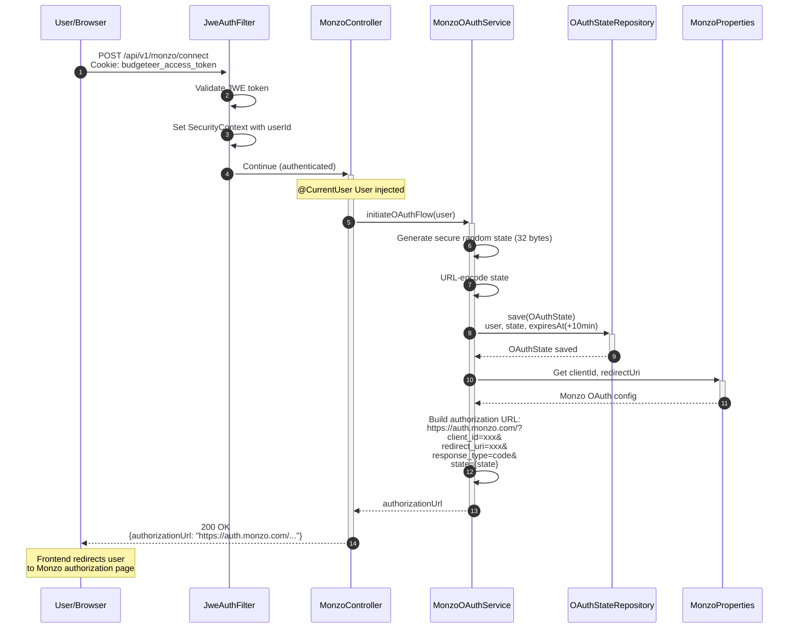

### State in Database

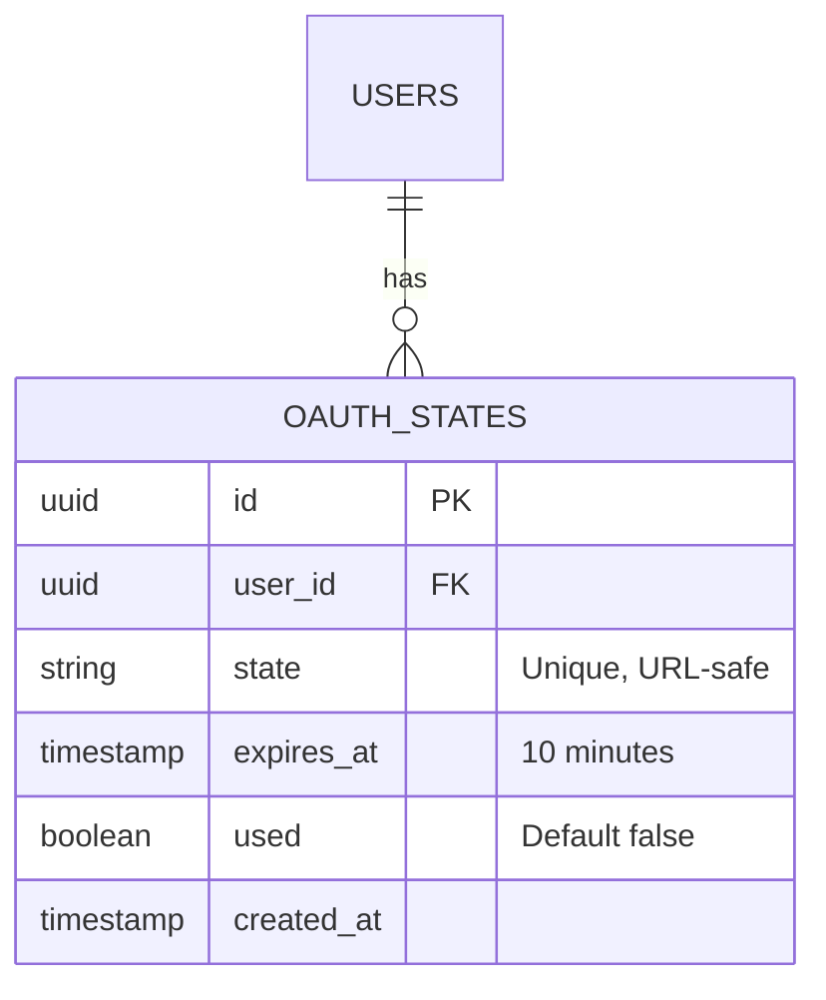

---

## 2. User Approves at Monzo

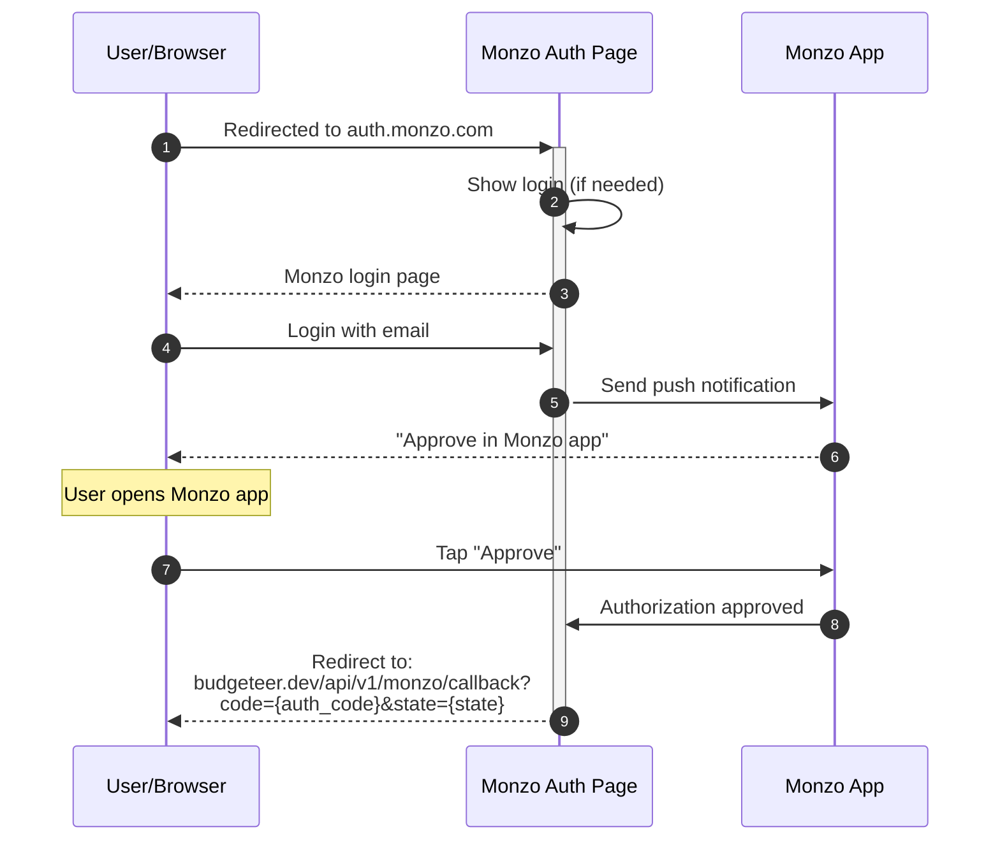

---

## 3. OAuth Callback (Token Exchange)

### Happy Path

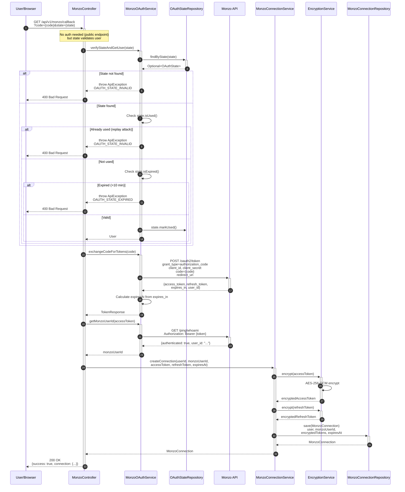

### Unhappy Paths - OAuth Callback

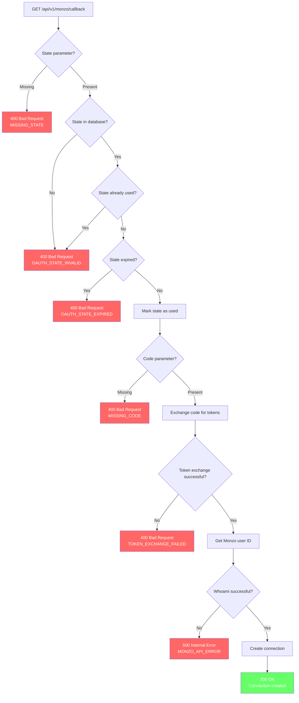

### Security: Replay Attack Prevention

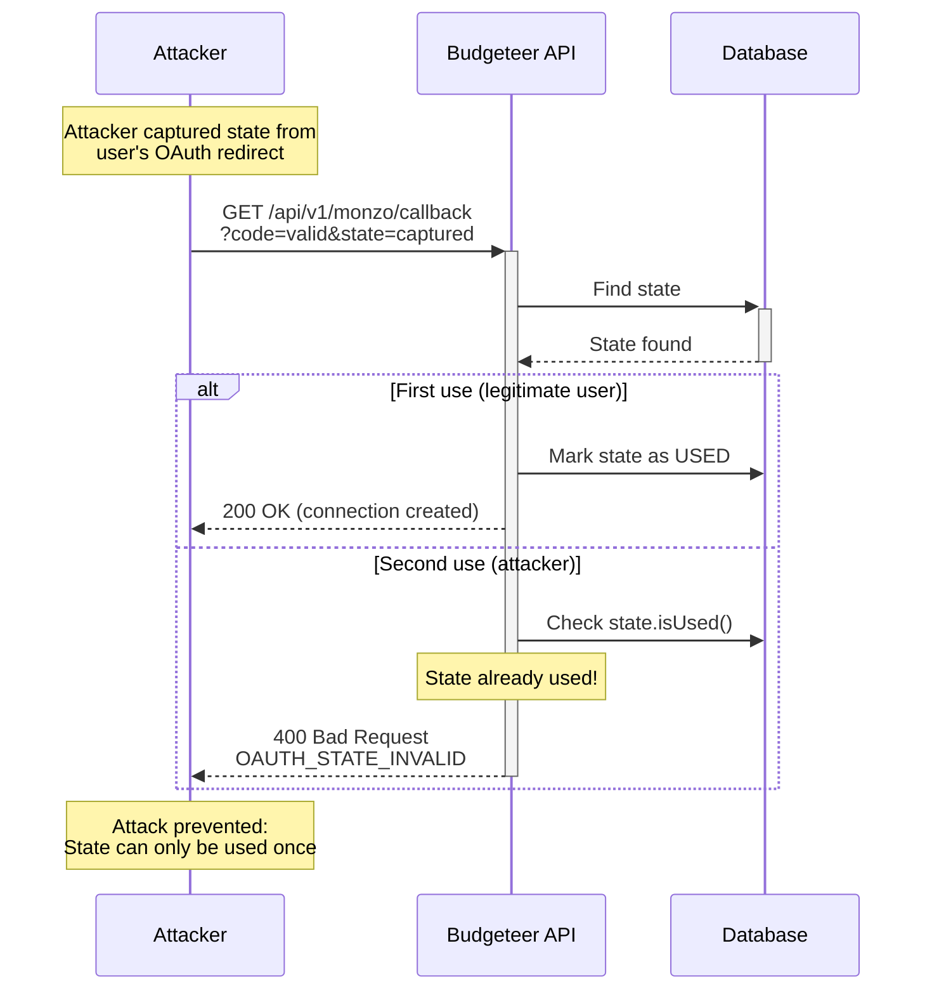

---

## 4. Token Storage & Encryption

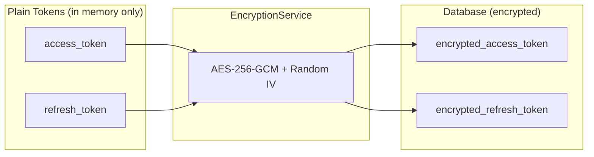

> **Encryption Format:** Each encrypted token contains: `IV (12 bytes) || Ciphertext || AuthTag (16 bytes)`

### MonzoConnection Entity

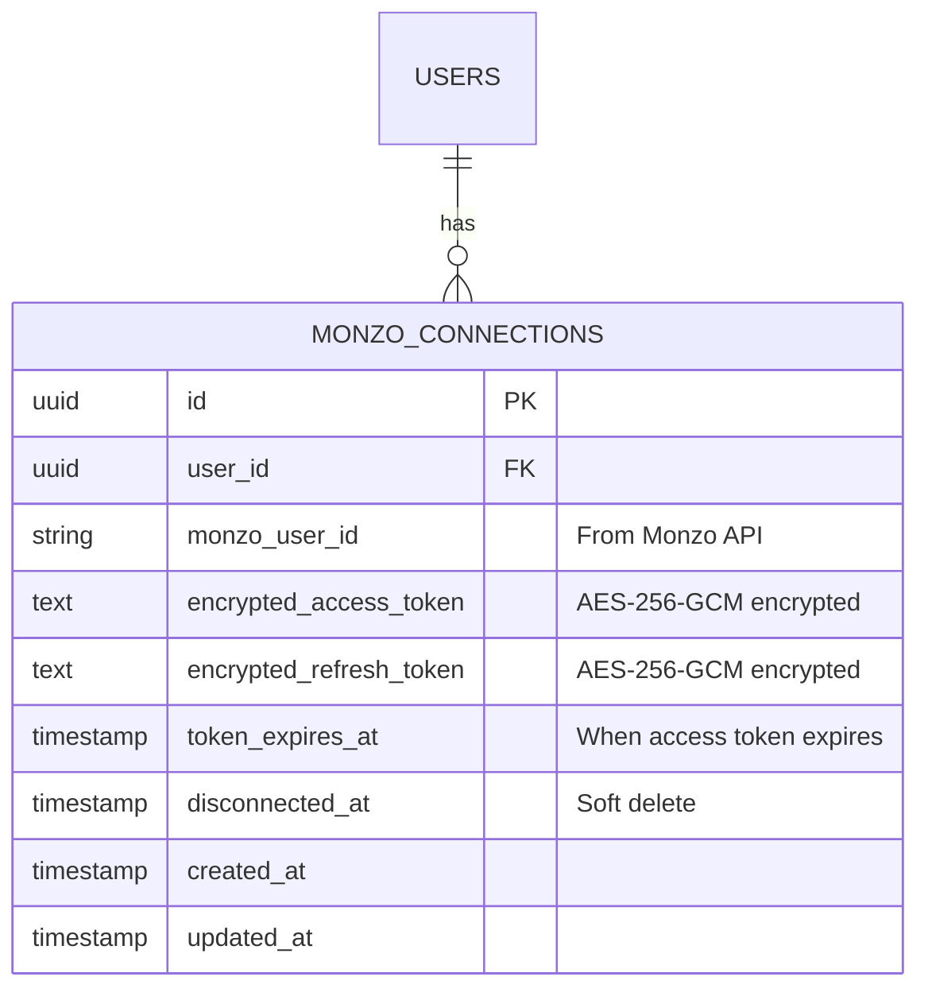

---

## 5. Connection Management

### List Connections

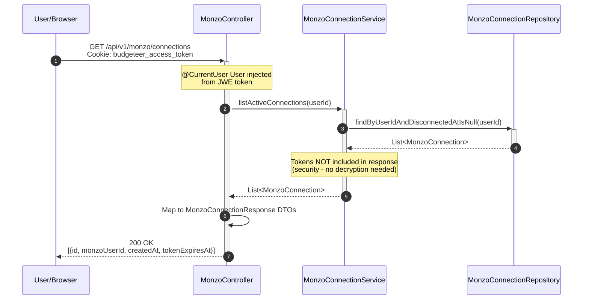

### Get Connection Status

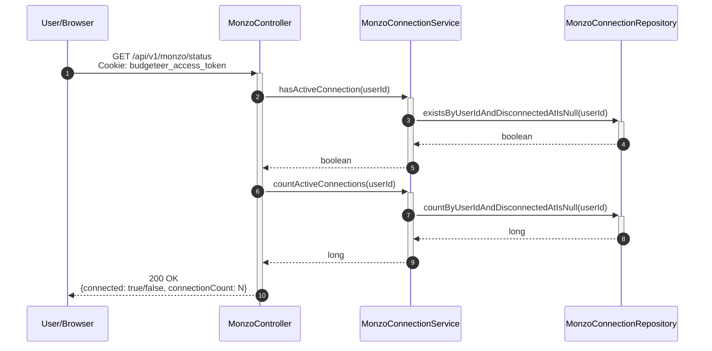

### Disconnect (Soft Delete)

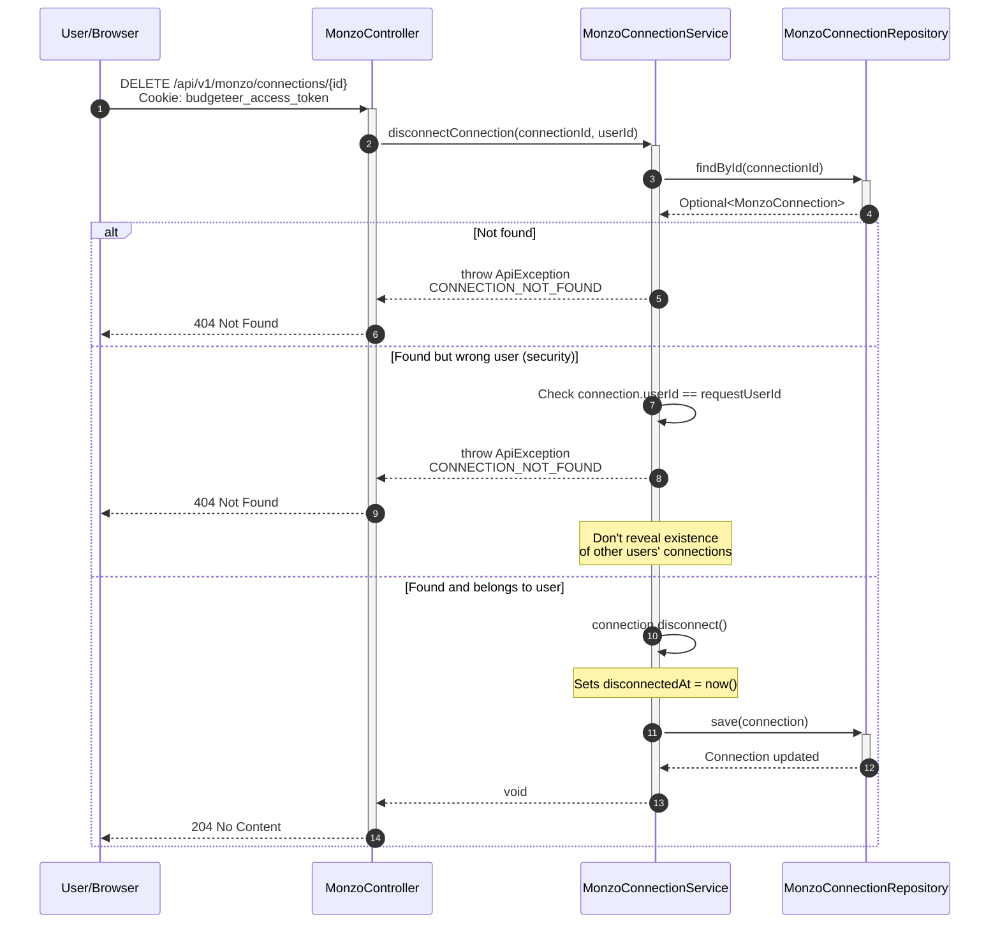

---

## 6. User Isolation

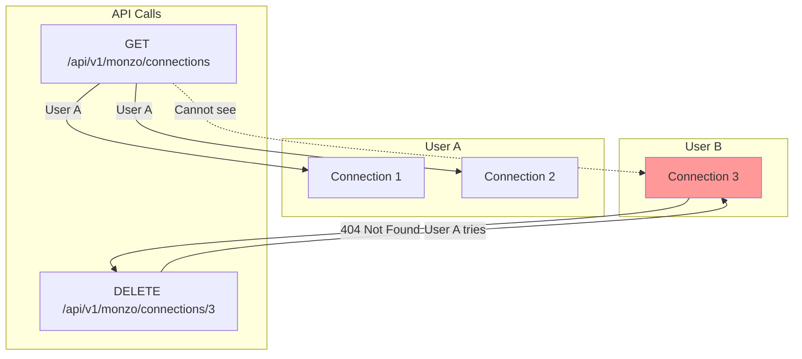

---

## Complete User Journey: Login to Connected

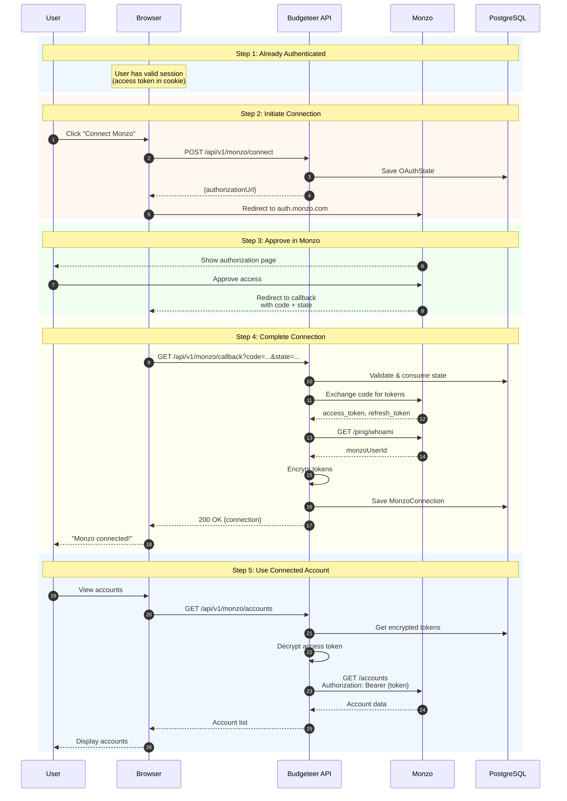

---

## OAuth State Lifecycle

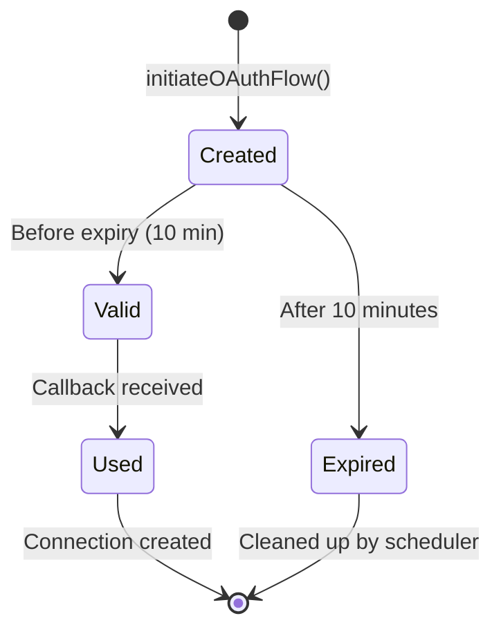

**State Details:**
- **Created**: State stored in DB with user reference
- **Valid**: User at Monzo auth page (within 10 min window)
- **Used**: One-time use prevents replay attacks

---

## Token Lifecycle

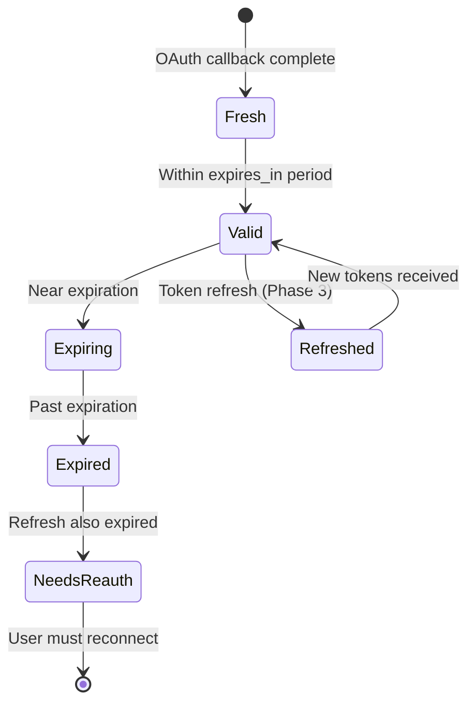

**Token Details:**
- **Fresh**: Tokens encrypted and stored immediately after OAuth
- **Valid**: Token can be used to call Monzo API
- **Expiring**: Near expiration - proactive refresh recommended (future Phase 3)
- **Expired**: Must use refresh token or re-authenticate
- **NeedsReauth**: Both access and refresh tokens expired

---

## Security Considerations

### 1. State Parameter (CSRF Protection)
- **Random**: 32 bytes of cryptographically secure random data
- **URL-safe**: Base64 URL encoded
- **Short-lived**: Expires after 10 minutes
- **Single-use**: Marked as used immediately on callback
- **User-bound**: Associated with specific user in database

### 2. Token Storage
- **Never in browser**: Tokens only exist server-side
- **Encrypted at rest**: AES-256-GCM with unique IV
- **Key rotation ready**: Can re-encrypt if key compromised

### 3. User Isolation
- **Authorization check**: Every connection operation verifies ownership
- **No information leakage**: 404 for other users' connections (not 403)

### 4. Callback Security
- **Public endpoint**: No auth needed (state provides user binding)
- **Rate limited**: Prevent brute-force state guessing (future)
- **State entropy**: 256 bits makes guessing infeasible

---

## Error Codes

| Code | HTTP Status | Description |
|------|-------------|-------------|
| `OAUTH_STATE_INVALID` | 400 | State not found or already used |
| `OAUTH_STATE_EXPIRED` | 400 | State older than 10 minutes |
| `TOKEN_EXCHANGE_FAILED` | 400 | Monzo rejected code exchange |
| `MONZO_API_ERROR` | 500 | Error calling Monzo API |
| `CONNECTION_NOT_FOUND` | 404 | Connection doesn't exist or wrong user |
| `ENCRYPTION_ERROR` | 500 | Failed to encrypt/decrypt tokens |

---

## Related Documentation

- [User Authentication Flow](./user-authentication-flow.md)
- [Monzo Token Persistence Feature](../features/MONZO-TOKEN-PERSISTENCE.md)
- [Monzo Auth Flow](../MONZO-AUTH-FLOW.md)
- [Security Architecture](../SECURITY-ARCHITECTURE.md)
- [Testing Guide](../TESTING.md)
