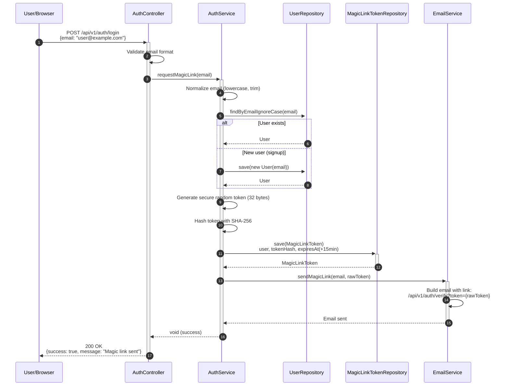
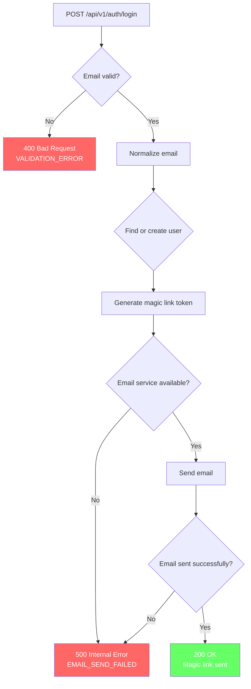
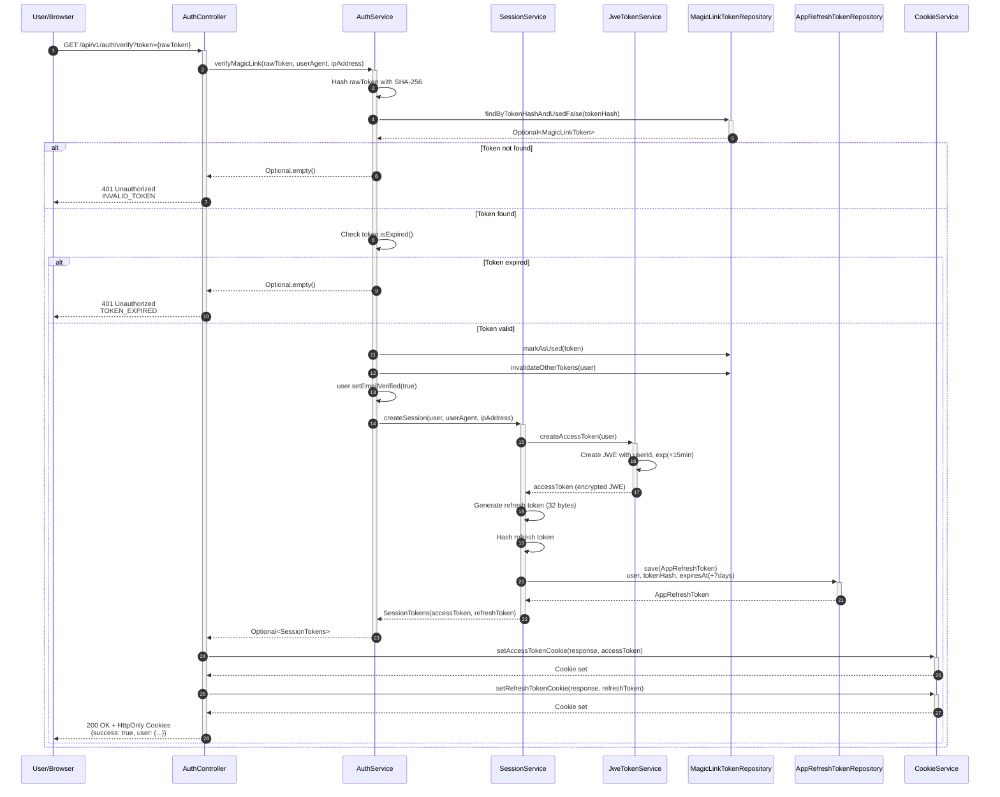
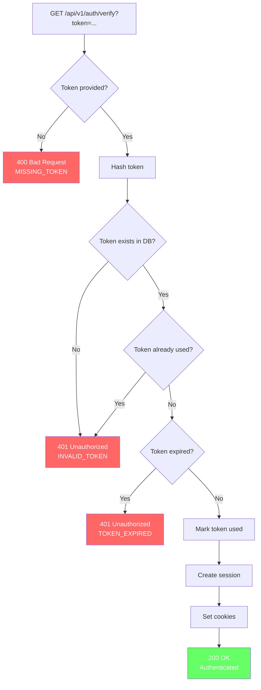
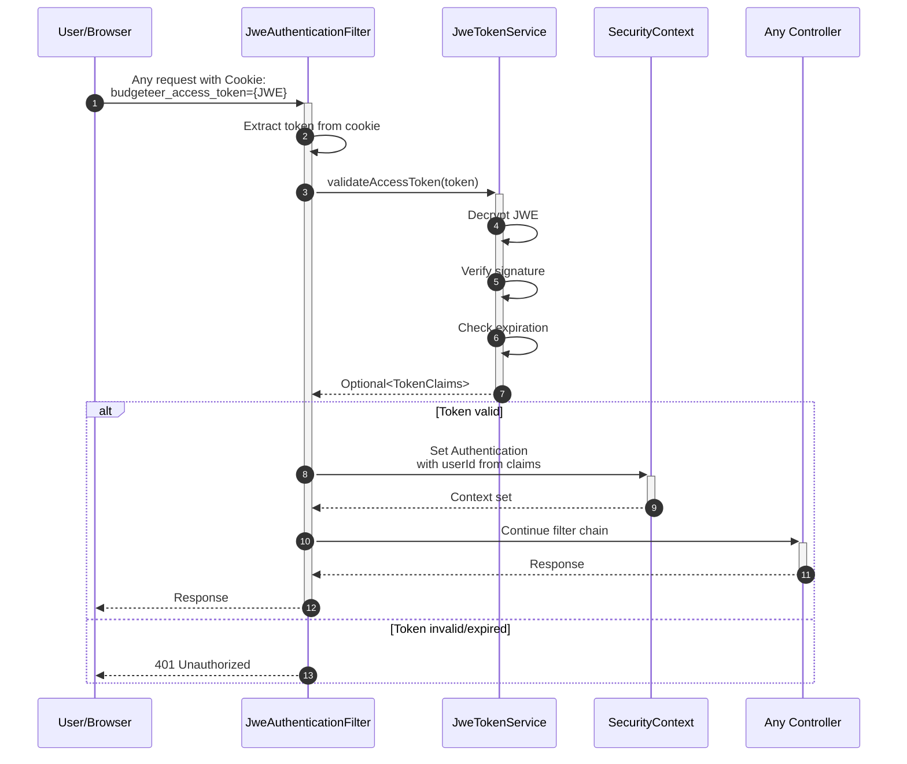
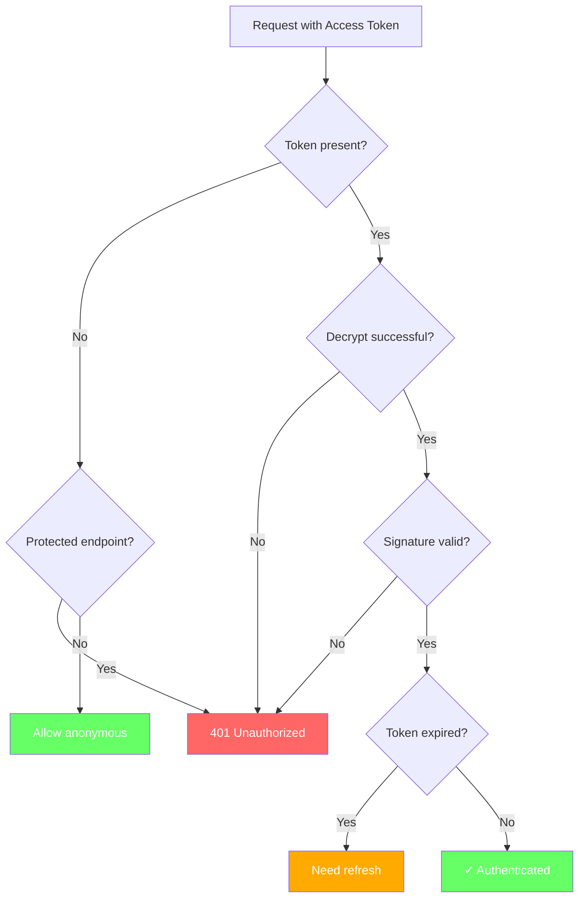
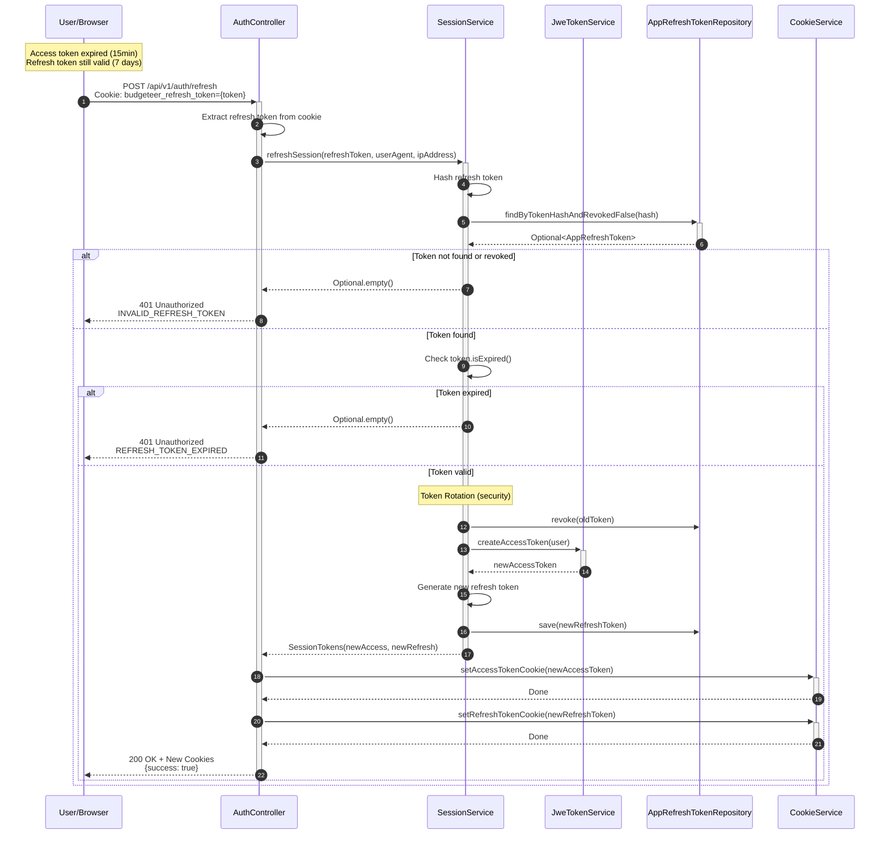
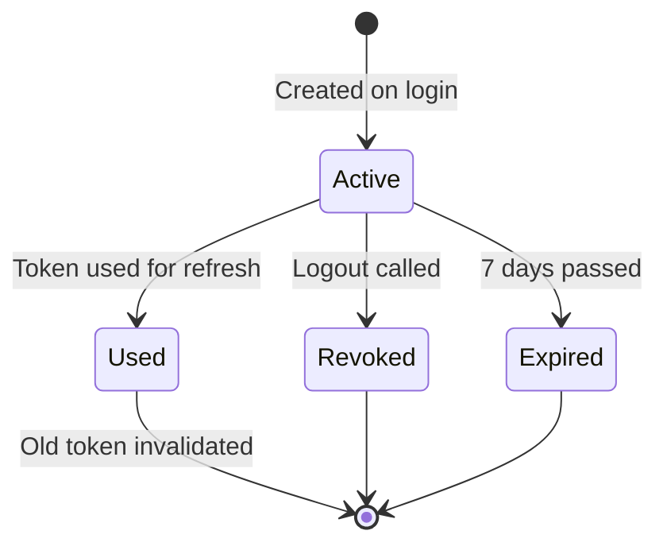
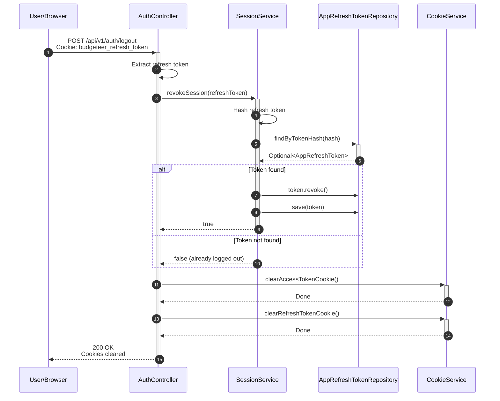
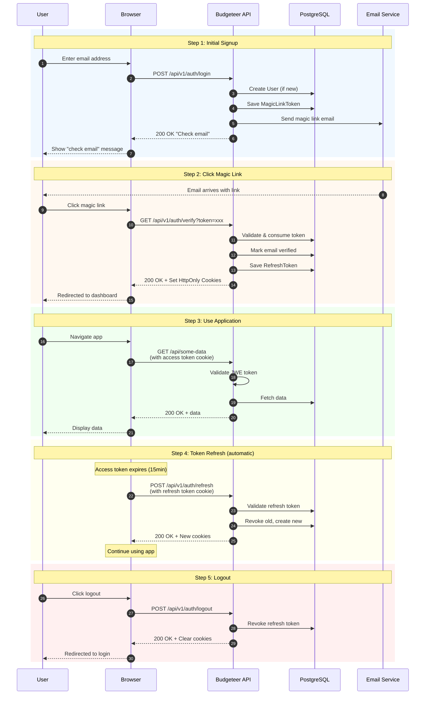

# User Authentication Flow

This document describes the complete authentication flow for Budgeteer, including magic link signup/login, session management, and token refresh.

## Overview

Budgeteer uses **passwordless authentication** via magic links sent to email. This provides:
- No passwords to remember or manage
- Email verification built into signup
- Secure, single-use tokens

## Components Involved

| Component | Type | Responsibility |
|-----------|------|----------------|
| `AuthController` | REST Controller | HTTP endpoints for auth |
| `AuthService` | Service | Orchestrates auth flow |
| `SessionService` | Service | Token creation & validation |
| `JweTokenService` | Service | JWE token encryption/decryption |
| `EmailService` | Service | Sends magic link emails |
| `CookieService` | Service | HTTP cookie management |
| `UserRepository` | Repository | User persistence |
| `MagicLinkTokenRepository` | Repository | Magic link persistence |
| `AppRefreshTokenRepository` | Repository | Refresh token persistence |

---

## 1. Magic Link Request (Signup/Login)

### Happy Path

### Unhappy Paths

---

## 2. Magic Link Verification

### Happy Path

### Unhappy Paths

---

## 3. Authenticated Request (Using Access Token)

### Happy Path

### Token States

---

## 4. Token Refresh Flow

### Happy Path

### Refresh Token States

> **Note:** When a token is used for refresh, a new token is issued and the old one is revoked (token rotation).

---

## 5. Logout Flow

### Happy Path

---

## Complete User Journey: Signup to Authenticated

---

## Token Lifetimes

| Token Type | Lifetime | Storage | Purpose |
|------------|----------|---------|---------|
| Magic Link | 15 minutes | DB (hashed) | One-time email verification |
| Access Token (JWE) | 15 minutes | HttpOnly Cookie | API authentication |
| Refresh Token | 7 days | DB (hashed) + HttpOnly Cookie | Session continuity |

---

## Security Considerations

1. **Magic Link Tokens**
   - Single-use (marked as used after verification)
   - Short expiry (15 minutes)
   - All pending tokens invalidated on successful verification
   - Stored as SHA-256 hash (raw token never stored)

2. **Access Tokens (JWE)**
   - Encrypted with AES-256-GCM
   - Short-lived (15 minutes)
   - Stateless (no DB lookup needed)
   - HttpOnly, Secure, SameSite cookies

3. **Refresh Tokens**
   - Longer-lived (7 days) for UX
   - Token rotation on each refresh (old token invalidated)
   - Stored as hash (prevents DB breach from being useful)
   - Can be explicitly revoked (logout)

4. **Single Session Policy**
   - New magic link verification invalidates all pending links
   - Ensures user controls their sessions

---

## Related Documentation

- [Security Architecture](../SECURITY-ARCHITECTURE.md)
- [User Authentication Feature](../features/USER-AUTHENTICATION.md)
- [Testing Guide](../TESTING.md)
