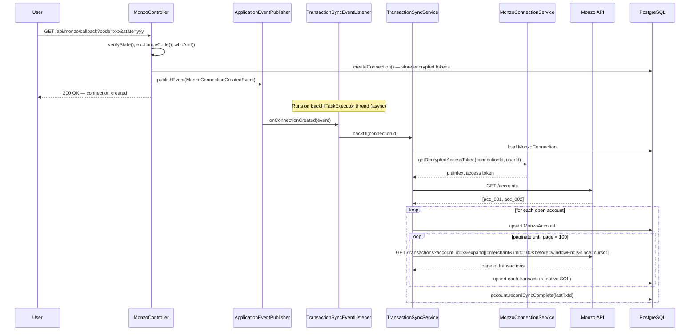
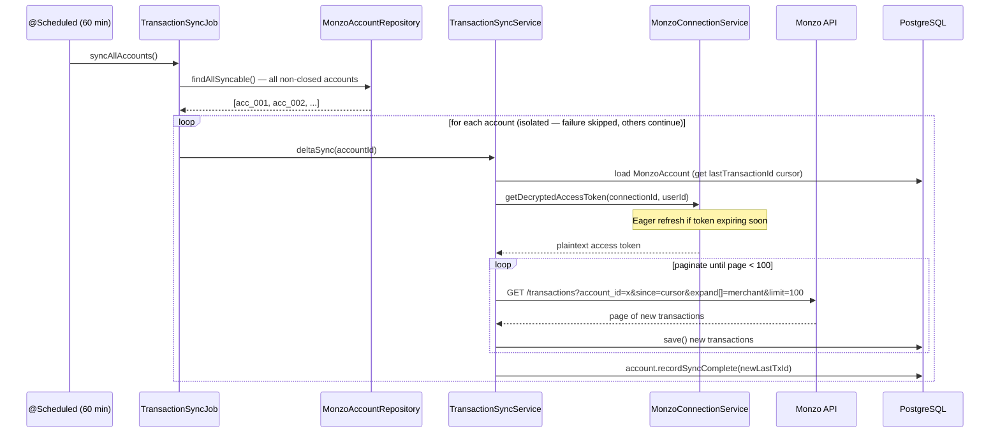

# Feature: Monzo Transaction Sync

> Raw sync of Monzo accounts and transactions into local PostgreSQL — an exact mirror of
> what Monzo returns, with no domain transformation. Two sync modes: immediate backfill
> triggered by OAuth completion, and periodic delta sync for ongoing updates.

---

## 📋 Feature Summary

| Field | Value |
|-------|-------|
| **Feature Branch** | `feature/transaction-sync` |
| **Status** | ✅ **Complete** |
| **Priority** | P2 |
| **Dependencies** | Monzo Token Auto-Refresh ✅ |
| **Blocks** | Domain Model feature (mapping to `transactions` table) |

---

## 🎯 Scope

### What Was Built

- [x] V7 migration: `monzo_accounts` table
- [x] V8 migration: `monzo_transactions` table
- [x] `MonzoAccount` + `MonzoTransaction` JPA entities (natural String PKs)
- [x] `MonzoAccountRepository` + `MonzoTransactionRepository` (incl. native upsert)
- [x] `client/monzo/dto/` — typed response records for Monzo API
- [x] `MonzoClient.getAccounts()` + `getTransactions()` (with `expand[]=merchant`)
- [x] `TransactionSyncService` — `backfill()` and `deltaSync()` with cursor pagination
- [x] `AsyncConfig` — `@EnableAsync` + `backfillTaskExecutor` thread pool
- [x] `MonzoConnectionCreatedEvent` + `TransactionSyncEventListener` (async post-OAuth backfill)
- [x] `TransactionSyncJob` — `@Scheduled` 60-minute delta sync
- [x] Publish `MonzoConnectionCreatedEvent` in `MonzoController.handleCallback()`
- [x] Dev retrigger endpoint: `POST /api/dev/monzo/backfill`
- [x] `ErrorCode.MONZO_SYNC_ERROR` (502)
- [x] DTO refactor: `TokenResponse` → `client/monzo/dto/`; `ConnectionStatus` → `api/monzo/dto/MonzoStatusResponse`
- [x] 575 tests (unit + integration, all green)

### Deliberately Out of Scope

This branch is **raw sync only**. The following are deferred to a follow-on domain model feature:

- `user_accounts` / `transactions` domain tables
- Mapping layer: `monzo_transactions` → unified domain model
- `GET /api/transactions` public endpoint
- Manual transaction entry (salary, rent, credit card spend)
- Categories, custom fields, enrichment

The reasoning: domain modelling decisions (what the unified `transactions` table looks like
for Monzo + Lloyds + manual entries) need real Monzo data to design against. This branch
gets the data in. The follow-on branch designs the schema with that data in hand.

---

## 🗄️ Database Schema

### V7 — `monzo_accounts`

Stores one row per Monzo account per connection. Delta sync state lives here.

| Column | Type | Notes |
|--------|------|-------|
| `id` | `VARCHAR(255) PK` | Monzo's natural `acc_xxx` ID |
| `connection_id` | `UUID FK` | References `monzo_connections` — CASCADE DELETE |
| `user_id` | `UUID FK` | References `users` — CASCADE DELETE |
| `account_type` | `VARCHAR(50)` | e.g. `uk_retail`, `uk_retail_joint` |
| `description` | `VARCHAR(500)` | Nullable |
| `currency` | `VARCHAR(3)` | e.g. `GBP` |
| `last_synced_at` | `TIMESTAMPTZ` | NULL = never synced |
| `last_transaction_id` | `VARCHAR(255)` | Transaction-id cursor for next delta sync (sent via Monzo's `since` param); NULL = no cursor |
| `closed` | `BOOLEAN` | Closed accounts are skipped during sync |
| `created_at` / `updated_at` | `TIMESTAMPTZ` | Managed by JPA lifecycle hooks |

### V8 — `monzo_transactions`

Raw Monzo data only. No custom fields — those belong in the domain model.

| Column | Type | Notes |
|--------|------|-------|
| `id` | `VARCHAR(255) PK` | Monzo's natural `tx_xxx` ID |
| `account_id` | `VARCHAR(255) FK` | References `monzo_accounts` — CASCADE DELETE |
| `user_id` | `UUID FK` | References `users` — CASCADE DELETE |
| `amount` | `INTEGER` | Pence; negative = debit, positive = credit |
| `currency` | `VARCHAR(3)` | e.g. `GBP` |
| `description` | `VARCHAR(500)` | Nullable |
| `merchant_name` | `VARCHAR(255)` | Nullable; from expanded merchant object |
| `merchant_category` | `VARCHAR(100)` | Nullable; e.g. `eating_out`, `transport` |
| `notes` | `TEXT` | Nullable; user-added notes in the Monzo app |
| `is_declined` | `BOOLEAN` | True for declined transactions |
| `monzo_created_at` | `TIMESTAMPTZ` | When Monzo recorded the transaction |
| `monzo_settled_at` | `TIMESTAMPTZ` | Nullable; NULL = pending (not yet settled) |
| `created_at` / `updated_at` | `TIMESTAMPTZ` | Managed by JPA lifecycle hooks |

---

## 🏗️ Architecture

### Two Sync Modes

```
┌─────────────────────────────────────────────────────────────┐
│  Mode 1: Backfill (immediate, after OAuth)                   │
│  Triggered: MonzoConnectionCreatedEvent                      │
│  Access: Full history (within Monzo's 5-min SCA window)      │
│  Thread: backfillTaskExecutor (async, non-blocking)          │
├─────────────────────────────────────────────────────────────┤
│  Mode 2: Delta Sync (periodic)                               │
│  Triggered: @Scheduled cron (every 60 minutes)               │
│  Access: New transactions since last_transaction_id cursor   │
│  Thread: Spring scheduler thread pool                        │
└─────────────────────────────────────────────────────────────┘
```

### Why Two Modes?

Monzo's API enforces **Strong Customer Authentication (SCA)**. Full transaction history
is only accessible within approximately 5 minutes of the user completing the OAuth flow
in-app. After that window closes, subsequent calls are limited to the most recent 90 days.

This creates a hard constraint: the backfill **must start immediately** after OAuth completes,
while the SCA approval is still fresh. Delta sync then keeps the data up to date going
forward, and does not need the SCA window.

### Monzo SCA Window

```
t=0         OAuth approved by user in Monzo app
t=0 → ~5min  SCA window OPEN  — full history accessible
t=5min+      SCA window CLOSED — only 90 days accessible

→ backfill() is triggered at t≈0, non-blocking (async)
→ deltaSync() runs every 60 min from there, requires no SCA
```

---

## 🔄 Flow Diagrams

### 1. Post-OAuth Backfill Flow



### 2. Delta Sync Flow (Scheduled Job)



### 3. Component Dependency Graph

```mermaid
graph TD
    MC[MonzoController] -->|publishes| EV[MonzoConnectionCreatedEvent]
    EV -->|@Async @EventListener| EL[TransactionSyncEventListener]
    EL --> SS[TransactionSyncService]

    TJ[TransactionSyncJob<br/>@Scheduled 60min] --> AR[MonzoAccountRepository<br/>findAllSyncable]
    TJ --> SS

    SS --> CS[MonzoConnectionService<br/>getDecryptedAccessToken]
    SS --> MCC[MonzoClient<br/>getAccounts / getTransactions]
    SS --> AAR[MonzoAccountRepository]
    SS --> TR[MonzoTransactionRepository<br/>native upsert]

    CS --> ES[EncryptionService<br/>AES-256-GCM decrypt]
    CS --> RS[MonzoTokenRefreshService<br/>eager refresh guard]
    MCC --> MonzoAPI[Monzo API]

    style EV fill:#fff3cd
    style EL fill:#d4edda
    style SS fill:#d4edda
    style TJ fill:#d4edda
```

### 4. Upsert Strategy (Backfill vs Delta)

```
Backfill — native SQL upsert (performance)
  ┌─────────────────────────────────────────────────────────────────┐
  │ INSERT INTO monzo_transactions (id, ...) VALUES (...)           │
  │ ON CONFLICT (id) DO UPDATE SET                                  │
  │   amount = EXCLUDED.amount,          ← price corrections        │
  │   monzo_settled_at = EXCLUDED.monzo_settled_at,  ← pending→settled │
  │   notes = EXCLUDED.notes,            ← user edited notes        │
  │   is_declined = EXCLUDED.is_declined,                           │
  │   updated_at = now()                                            │
  └─────────────────────────────────────────────────────────────────┘

  Why native upsert?
  SELECT + UPDATE per row would be 2 round-trips × potentially 1000s of rows.
  Native upsert is a single statement per row. The ON CONFLICT clause also handles
  re-running backfill idempotently — safe to run multiple times.

Delta — JPA save() (simplicity)
  New rows dominate delta syncs. The cursor (a transaction id, sent via `since`) prevents
  fetching already-seen transactions, so plain save() is fine. Pending→settled updates can still happen
  if a transaction settles between delta runs.
```

---

## 🧩 Components

### New Files

| Path | Purpose |
|------|---------|
| `db/migration/V7__create_monzo_accounts.sql` | Raw Monzo accounts table |
| `db/migration/V8__create_monzo_transactions.sql` | Raw Monzo transactions table |
| `domain/monzo/MonzoAccount.java` | Account entity; String PK; holds sync cursor |
| `domain/monzo/MonzoTransaction.java` | Transaction entity; String PK |
| `repository/MonzoAccountRepository.java` | `findByConnectionId`, `findByUserId`, `findAllSyncable` |
| `repository/MonzoTransactionRepository.java` | JPQL queries + native `upsert()` |
| `config/AsyncConfig.java` | `@EnableAsync`, `backfillTaskExecutor`, uncaught exception handler |
| `config/TransactionSyncProperties.java` | `@ConfigurationProperties(prefix="monzo.transaction-sync")` |
| `service/monzo/MonzoConnectionCreatedEvent.java` | `record(UUID connectionId, UUID userId)` |
| `service/monzo/TransactionSyncEventListener.java` | `@Async("backfillTaskExecutor") @EventListener` |
| `service/monzo/TransactionSyncService.java` | `backfill()` + `deltaSync()` |
| `service/monzo/TransactionSyncJob.java` | `@Scheduled` cron entry point |
| `client/monzo/dto/TokenResponse.java` | Moved from inline in `MonzoClient` |
| `client/monzo/dto/MonzoAccountResponse.java` | Single account from `GET /accounts` |
| `client/monzo/dto/MonzoAccountsResponse.java` | `{ accounts: [] }` wrapper |
| `client/monzo/dto/MonzoMerchantResponse.java` | Merchant sub-object on a transaction |
| `client/monzo/dto/MonzoTransactionResponse.java` | Single transaction from `GET /transactions` |
| `client/monzo/dto/MonzoTransactionsResponse.java` | `{ transactions: [] }` wrapper |
| `api/monzo/dto/MonzoStatusResponse.java` | Moved from inline `ConnectionStatus` in `MonzoController` |

### Modified Files

| Path | Change |
|------|--------|
| `client/monzo/MonzoClient.java` | Add `getAccounts()`, `getTransactions()`; import `TokenResponse` from dto package |
| `api/monzo/MonzoController.java` | Inject `ApplicationEventPublisher`; publish event post-callback; use `MonzoStatusResponse` |
| `api/dev/DevAuthController.java` | Add `POST /api/dev/monzo/backfill` (dev profile only) |
| `api/common/ErrorCode.java` | Add `MONZO_SYNC_ERROR` (502) |
| `application.properties` | Add `monzo.transaction-sync.*` properties |

---

## ⚙️ Configuration

```properties
# Cron schedule for the delta sync job (every 60 minutes)
monzo.transaction-sync.job-cron=0 0 */1 * * *

# Backfill thread pool
monzo.transaction-sync.backfill-core-pool-size=2
monzo.transaction-sync.backfill-max-pool-size=5
monzo.transaction-sync.backfill-queue-capacity=10
```

The `job-cron` property is consumed directly by `@Scheduled` via Spring EL and is not
bound to `TransactionSyncProperties`.

---

## 🛠️ Dev Retrigger: How It Works Without Redoing OAuth

The dev endpoint (`POST /api/dev/monzo/backfill`) lets you re-run a full backfill
without going through the real Monzo OAuth flow again. Here is why that is possible.

### The Key Insight: OAuth Tokens Persist in the Database

When a user completes OAuth, `MonzoController.handleCallback()` encrypts the Monzo access
and refresh tokens and stores them in `monzo_connections`. Those tokens remain valid until:

- The user revokes access in the Monzo app, or
- The tokens expire and fail to refresh (then the connection is soft-deleted)

The **backfill does not need OAuth**. It only needs:

1. A `MonzoConnection` row in the DB (to know which connection to sync)
2. Valid encrypted tokens in that row (to authenticate API calls)

### Dev Workflow

```
┌─────────────────────────────────────────────────────────────────┐
│ First time after a DB reset:                                     │
│                                                                  │
│ 1. Restart app (DB clean — all tables empty including tokens)   │
│ 2. Complete real Monzo OAuth once:                              │
│      GET /api/monzo/connect → redirects to Monzo               │
│      User approves → Monzo redirects to /api/monzo/callback     │
│ 3. Backfill auto-fires (MonzoConnectionCreatedEvent)            │
│ 4. Tokens now stored in monzo_connections                       │
└─────────────────────────────────────────────────────────────────┘

┌─────────────────────────────────────────────────────────────────┐
│ Subsequent iterations (re-sync without re-doing OAuth):         │
│                                                                  │
│ 1. Truncate monzo_accounts + monzo_transactions (optional)      │
│    OR just call the trigger — upsert is idempotent              │
│ 2. POST /api/dev/monzo/backfill (with session cookie)       │
│ 3. Endpoint looks up your active MonzoConnection by userId      │
│ 4. Calls transactionSyncService.backfill(connectionId)          │
│ 5. backfill() loads the stored tokens, decrypts, calls Monzo    │
│ 6. All accounts + transactions re-inserted / updated            │
└─────────────────────────────────────────────────────────────────┘
```

### Why the Monzo Tokens Are Still Valid

- `MonzoTokenRefreshJob` runs every 30 minutes and proactively refreshes tokens before
  they expire. As long as the app is running and the user has not revoked access, tokens
  remain live indefinitely.
- `TransactionSyncService` calls `connectionService.getDecryptedAccessToken()`, which
  includes an eager refresh guard — if the token is within 5 minutes of expiry, it is
  refreshed inline before the Monzo API call.

### SCA Window and the Dev Trigger

The Monzo **SCA window** (approximately 5 minutes after OAuth) only affects access to full
transaction history beyond 90 days. After the window closes:

- You can still call `GET /transactions` — you get the last 90 days
- The dev trigger works perfectly for testing with recent transactions
- For a full historical backfill you need to re-do OAuth to re-open the SCA window

In practice during development, the most recent 90 days of transactions is more than enough
to test sync logic, pagination, delta behaviour, and the domain model.

### What the Endpoint Does

```java
// DevAuthController.java (dev profile only)
@PostMapping("/sync/trigger")
public ResponseEntity<ApiResponse<Void>> triggerSync(@CurrentUserId UUID userId) {
    // 1. Find the user's active MonzoConnection
    var connection = connectionRepository
            .findActiveByUserId(userId)
            .stream().findFirst()
            .orElseThrow(() -> new ApiException(RESOURCE_NOT_FOUND, ...));

    // 2. Call backfill directly — no event bus, no async
    //    (runs synchronously so you can see it complete in the response)
    transactionSyncService.backfill(connection.getId());

    return ResponseEntity.ok(ApiResponse.of(null));
}
```

Notice it calls `backfill()` **directly** (synchronously), unlike the post-OAuth path
which fires it async via the event bus. This means the HTTP request blocks until the
backfill completes, which is useful in dev — you can see in the logs exactly what happened
before the response returns.

---

## 🔌 API Reference

### `GET /accounts` (Monzo API, internal)

Called by `MonzoClient.getAccounts()`. Returns all accounts for the token holder.

### `GET /transactions` (Monzo API, internal)

Called by `MonzoClient.getTransactions()`. Always includes `expand[]=merchant` so the
merchant name and category are populated without a separate call.

```
GET /transactions?account_id=acc_xxx&expand[]=merchant&limit=100[&since=<ts|tx_xxx>][&before=ts]
```

| Param | Required | Notes |
|-------|----------|-------|
| `account_id` | Yes | The Monzo account to fetch transactions for |
| `expand[]` | Yes | Always `merchant` — populates merchant sub-object |
| `limit` | Yes | Always 100 (page size) |
| `since` | No | Lower bound — accepts **either** an RFC3339 timestamp **or** a transaction id. Monzo has no separate `since_id` param; the cursor is sent here |
| `before` | No | Upper bound — RFC3339 timestamp; pins the window end during backfill pagination |

---

## 🔒 Security Notes

| Concern | Handling |
|---------|---------|
| Tokens in memory | Decrypted immediately before use in `getDecryptedAccessToken()`, not stored in fields |
| Token logging | Never logged — `TransactionSyncService` only logs account IDs and counts |
| Backfill thread isolation | `backfillTaskExecutor` is a separate thread pool — backfill failures cannot affect the HTTP thread that returned the OAuth response |
| Uncaught async exceptions | `AsyncConfig` registers an `AsyncUncaughtExceptionHandler` that logs method name + exception |
| Backfill failure recovery | `TransactionSyncEventListener.onConnectionCreated()` wraps the call in a try/catch — a backfill failure never propagates to the OAuth caller |
| Dev endpoint | `DevAuthController` is `@Profile("dev")` — the endpoint is not compiled into the production context |

---

## 🧪 Test Coverage

### Unit Tests

| Class | Tests | What It Covers |
|-------|-------|----------------|
| `MonzoClientTest` | 5 | `getAccounts()` happy path + 401; `getTransactions()` with/without `sinceId`; `expand[]=merchant` always present |
| `TransactionSyncServiceTest` | 4 | Backfill with 2 accounts; pagination (100 then 5 items); deltaSync with cursor; deltaSync null cursor (first run) |
| `TransactionSyncJobTest` | 3 | 3 accounts synced; 1 throws → other 2 complete; no-op when no accounts |
| `TransactionSyncEventListenerTest` | 2 | Event triggers backfill; backfill exception is swallowed |

### Integration Tests (WireMock + Testcontainers)

| Class | Tests | What It Covers |
|-------|-------|----------------|
| `TransactionSyncIT` | 4 | Full backfill: accounts + transactions in DB; closed account skipped; pagination (105 rows across 2 pages); cursor updated |
| `DevSyncTriggerIT` | 2 | `POST /api/dev/monzo/backfill` → backfill fires → rows inserted; 401 when unauthenticated |

---

## 📝 Key Design Decisions

### Spring Events over direct `@Async` service call

`MonzoController` publishes a `MonzoConnectionCreatedEvent` rather than injecting
`TransactionSyncService` directly. This keeps `TransactionSyncService` out of the
controller's dependencies, and allows future listeners (e.g. "send a connection
confirmation email", "notify the user via webhook") to hook into the same OAuth event
without touching the OAuth code.

### Natural String PKs

Both `MonzoAccount` and `MonzoTransaction` use Monzo's own IDs (`acc_xxx`, `tx_xxx`) as
their primary keys. This means there is no surrogate UUID to manage, and JPA's
`merge()` / `save()` behaviour combined with the native upsert handles idempotency
correctly — running backfill twice produces the same DB state as running it once.

### Raw sync layer, domain model deferred

`monzo_transactions` is a faithful mirror of what Monzo returns. It is not the rendering
layer for the budgeting dashboard. That layer (covering Monzo + Lloyds + manual entries)
will be designed once real Monzo data is available to inform the schema decisions.

---

## 🔗 Related Documents

- [Monzo Token Auto-Refresh](MONZO-TOKEN-AUTO-REFRESH.md)
- [Monzo Token Persistence](MONZO-TOKEN-PERSISTENCE.md)
- [Security Architecture](../SECURITY-ARCHITECTURE.md)
- [Task Plan](../../.agents/tasks/transaction-sync/plan.md)

---

**Created:** May 2026
**Last Updated:** May 2026
